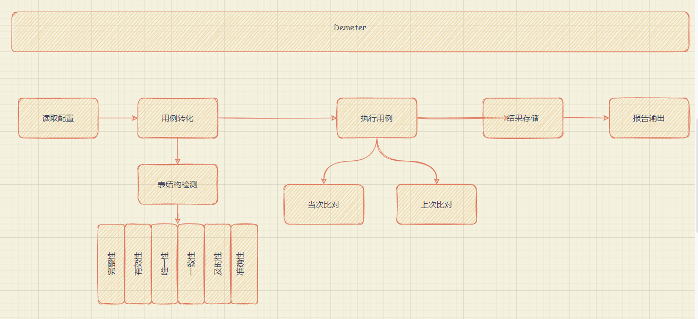

## Demeter

### 前言

目前在从事数据治理的相关测试工作，从治理工作上看分为勘探、抽取、清洗、融合，从测试具体的实施动作来讲，就是根据治理的需求，使用sql对治理过程的前后表字段、字段内容进行对比测试，本质上还是面向sql的测试工作。

目前，针对数据治理过程的测试，存在几个痛点：

- 涉及的表多：数据治理依赖的表资源繁多，大部分场景下数据测试的方法是相似的，围绕需求和业务场景，按照数据质量的六个维度进行分析
- 涉及的字段多：表-字段，无疑又增加了测试成本
- 预期难以量化明确：预期是跟常识、业务密切联系在一起，甚至有些场景，在测试准备时无法明确预期，根据结果来研判实际结果是否正确
- 需要的数据繁杂：这个是另一个维度的痛点，测试数据构造测试场景测试完成之后，上线总是会存在意想不到的问题，数据层面的异常无法在测试环境里覆盖

前三点都是围绕测试用例及测试执行，本质上是重复的测试方法对测试成本的影响。

### 构想

结合在前公司的业务台账的设计理念和数据驱动的思想，将通用的测试方法进行固化，结合当前项目在使用的表结构设计，通过读取表结构快速生成执行sql，再通过一定的经验积累，初步先明确或者缩小预期的标准，将测试分析和测试准备结合在一起，同时缩短测试执行（首次测试和回归测试的时间）。



### 实施

#### 相关选型

|        | 内容               | 缘由                         | 备注                         |
| ------ | ------------------ | ---------------------------- | ---------------------------- |
| INPUT  | 表格excel,xlsx格式 | 血缘关系通过excel维护        | 项目需求维护内容             |
| DOING  | yaml               | 组织结构清晰，也方便后续转换 |                              |
| OUTPUT | sqlite             | 持久化存储                   | 轻量化存储，存储本次运行结果 |
|        | html               | 可视化报告                   | 报告输出内容                 |

#### 读取配置

对外只暴露连接配置，存储连接的相关信息

```
[Hive]
#Hive服务器ip
server_info=
#Hive连接端口
server_port=
#Hive用户
user=
#Hive密码
password=
```

